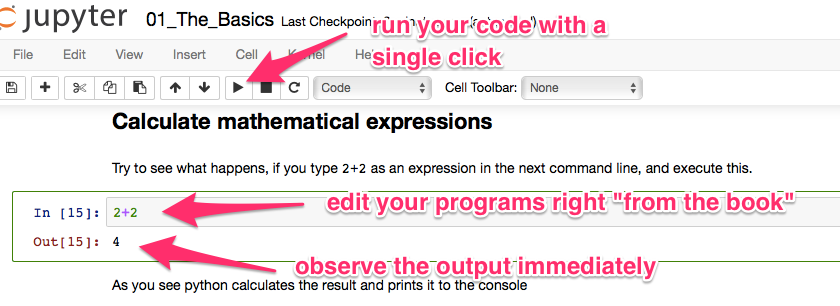

Music-Cage-Machine
=================

## Music-Cage-Machine is an infrastructure project
Use Music-Cage-Machine to create a simple virtual machine ready to develop and use music related techonology and deep learning, for example [magenta](https://github.com/tensorflow/magenta). Developed from [basket4py](https://github.com/rreben/basket4py) it is provisioned using ansible. Jupyter notebooks from a virtual vagrant enabled development environment.

## A python environment with anaconda and vagrant
This project gives you an easy start with python:
+ Develop your python scripts within jupyter notebooks
+ Use a full blown anaconda stack for data science task
+ Visualize you data with
    * Matplotlib
    * seaborn
+ The whole environment is setup within a virtual linux box, so your computer won't be impacted by any installation of the python environment.
+ The provisioning is done with ansible, so the recipes can easily be customized.
+ Everything is based on virtualbox and vagrant. So the whole setup is portable from one computer to the next and works independently from your OS (i.e. it works as well with OSX as with windows)

## Integrated platform to edit and run your programs

## How to get started
### Installation
If you know how to insall programs on a Mac or PC, you should be able to get everything up and running. If not, ask someone to help you.

Follow these simple steps to install everything you need to start programming:
1. install [virtual box](https://www.virtualbox.org/wiki/Downloads).
* install [vargrant](https://www.vagrantup.com/downloads.html).
* Copy the [zipfile from Github](https://github.com/LESSSE/magenta-machine). And extract it somewhere.
* Use a terminal (dos-prompt / cmd) and navigate to the folder that contains the extracted files. You should find a file named `vagrantfile`.
* type in `vagrant up`. This command will prepare a "virtual computer" on your pc or mac. Everything will be installed within this "virtual computer" so there won't be any interferences with other programs on your mashine.
* type in `vagrant provision` this command may take even longer (leave it for the night). It will install a modern python development environment.

## What does it already include?
Most of the midi libraries for python and magenta models

